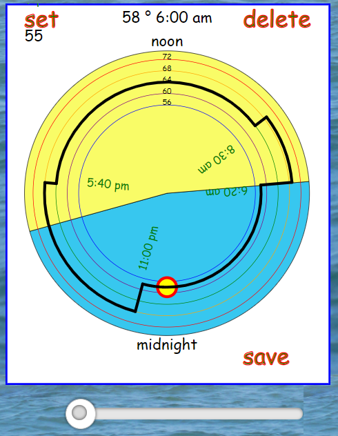

# @mckennatim/react-zonetimer

A custom package used by iot.sitebuilt.net to create a mobile freindly SVG react component that can create and modify a 24 hour schedule. The schedule that is input and output is in a minimalist format suitable for transmitting to and from an iot.sitebuilt.net device. In addition to the SVG, the component includes a range slider.

## iot.sitebuilt.net devices

IOT devices typically contain sensors and relays. `esp8266` and `esp32` devices also have builtin WIFI and multiple timers. 

`iot.sitebuilt.net (sbiot)` devices communicate over a lightweight protocal called `mqtt`. One of its internal timers is set to go off every 24 hours sometime after midnight (device time) at which point the clock is reset and that days schedule is downloaded to the device for each of the sensors and relays that are scheduled.

The `sbiot` devices sets up whatever timers are needed to execute the days schedule for all of its schedules sensors and relays. If the device loses contact with the server it will continue to run that schedule or a default schedule until contact is reestablished.

Schedules are typically of two types. On is binary, like a light timer or sprinkler timer, instructing when a devices relay should go on and when it should go off. The other is analog, where the device is given an instruction on what setting of a sensor triggers some action on the device. Typically the `sbiot` device monitors its environment, comparing what it senses to the current period's setting value. Examples would include thermostats, or humidity controls.

Any of the daily schedules runing on the `sbiot` device can be modified by authorized users. The `ZoneTime` component eases the process of setting up a day's schedule for one scheduled sensor/relay for an `sbiot` device

## usage

    npm install @mckennatim/react-zonetimer

    import{ZoneTimer} from '@mckennatim/react-zonetimer'

    <ZoneTimer 
      asched={tsched}
      range={[55,75]}
      templines={[
        {v:72,c:'red'}, 
        {v:68, c:'orange'},
        {v:64, c:'green'},  
        {v:60, c:'purple'}, 
        {v:56, c:'blue'}]}
      sunrise={sunrise} 
      sunset={sunset} 
      retNewSched={setNewSched}
    />

## props

### asched 

`asched` is an 2 dimesional array typically in one of two formats, analog 

    [[0,0,58], [6,20,69], [8,30,64], [17,40,68], [23,0,58]]

or binary

    [[0,0,0], [6,20,1], [8,30,0], [17,40,1], [23,0,0]]

where each subarray is of the form `[hr, min, val]` Hours are in 24 hour format.

### range 

An array defining the maximum and minimum values of a devices schedule

### templines

An array of objects that causes a set of concentric circles to be drawn on the component. These circles serve as intermediary indicators over the range of setting values

### sunrise and sunset

A string in the format `15:20` provided by device through the `useDevSpecs` function of `@mckennatim/mqtt-hooks package. One of the objects it returns is labeled `binf`. `binf.locdata` provides information on device location including address, lat, lng, timezone, sunrise and sunset.

### retNewSched

Upon completion of a schedule, pressing the `save` button on the SVG component returns the modified schedule to the parent component.

## refs
https://github.com/tranbathanhtung/usePosition

https://til.hashrocket.com/posts/hwybnwyfyz-get-a-ref-to-a-dom-element-with-react-hooks